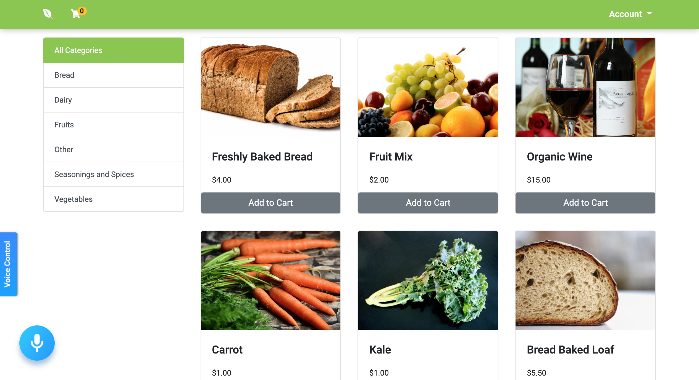
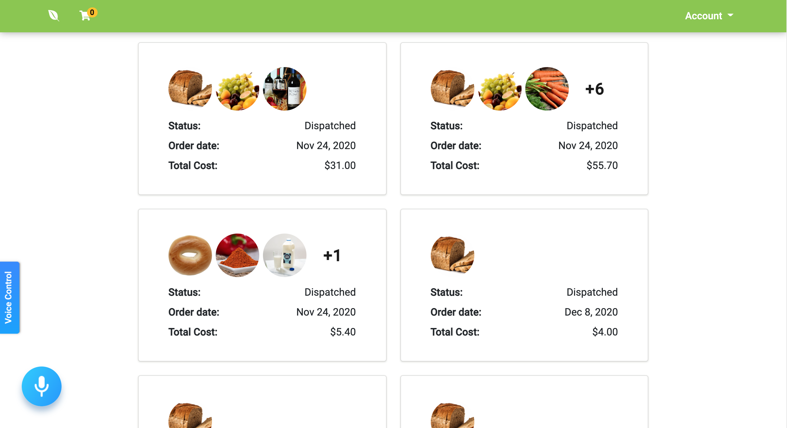
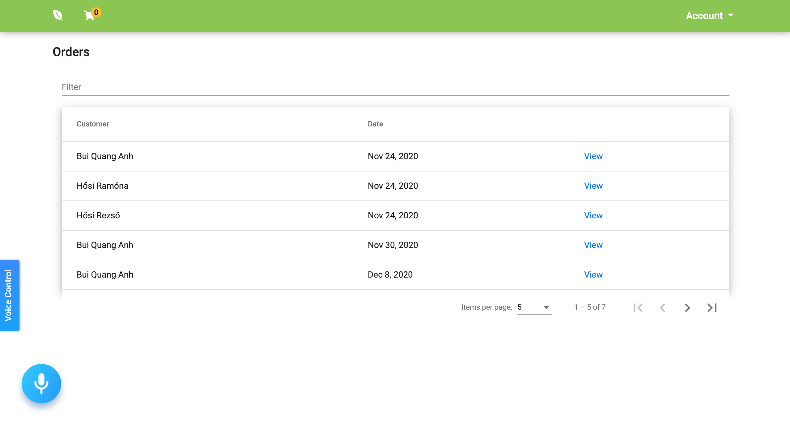

# 🥕 Organic Ingredients

An E-commerce application where you can buy organic ingredients with an inbuilt voice recognition feature.

## ✨ Features

- Catalogue for the organic ingredients 📖 
- Shopping cart which stores the products in the cart even after refreshing the page 🛒
- Filter products by categories 🤏
- Checkout 🏁
- My orders page which lists every order you have made 📦
- User authentication system (login, register) 🙎‍♂️
- Login with Google or Facebook ✔️
- Add, edit and delete products for admins ✍️
- Manage orders for admins ✍️
- Voice control feature 🎤 (Add, remove item, clear cart etc...)

## 🕹️ Installation

Use the package manager [npm](https://www.npmjs.com/) to install the dependencies.

```bash
npm install
```

To run the development server:

```bash
npm run start
```


## 🖥️ Technologies Used

Frontend: TypeScript, HTML5, SASS, Angular.  
Backend: Firebase.  
Database: Firebase.  
Miscellaneous: Angular Material, Bootstrap, Alan AI.  

## Preview




